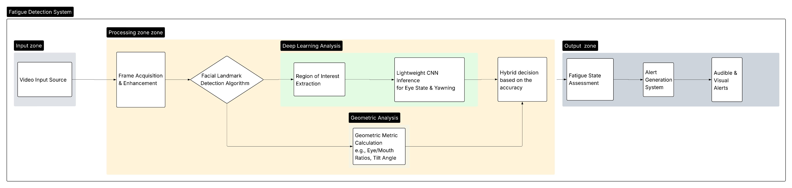
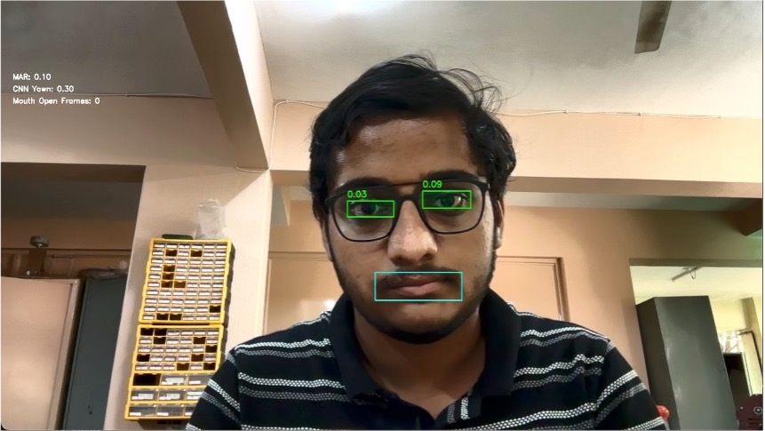

# 🚗 Hybrid Driver Fatigue Detection System on Edge Devices

## 📌 Overview
This project implements a **real-time, hybrid driver fatigue detection system** optimized for **resource-limited edge devices** like Raspberry Pi.  
It combines **lightweight Convolutional Neural Networks (CNNs)** with **geometric landmark-based analysis** to detect early signs of fatigue such as **eye closure** and **yawning**.

The hybrid fusion approach enhances accuracy, reduces false positives, and ensures efficient computation, making it ideal for **intelligent driver assistance systems**.

---

## 🎯 Objectives
- Develop **lightweight CNN models** for detecting eye state and yawning.
- Integrate **geometric feature analysis** (EAR, MAR, head pose) to improve robustness.
- Optimize for **real-time inference** on **embedded devices**.
- Evaluate performance in terms of **accuracy**, **latency**, and **robustness**.

---

## 🛠 System Architecture
The fatigue detection pipeline follows these stages:

1. **Data Acquisition & Preprocessing**
2. **Facial Landmark Localization**
3. **Multi-Modal Feature Extraction** (Geometric + CNN)
4. **Hybrid Decision Logic**
5. **Alert Generation**

### 📷 Architecture Diagram

---

## 📊 Datasets & Training
- **Eye State Detection:** MRL Eye Dataset + custom data.
- **Yawn Detection:** Public yawn dataset + custom data.
- ~500,000 images per dataset.

**Preprocessing:**
- Resize images (128×128 for eyes, 96×96 for mouth).
- Normalize pixel values to [0,1].
- Augment with flips, brightness changes, and noise.

**Training Configuration:**
- Binary Cross-Entropy loss.
- Adam optimizer.
- 32 epochs, 90:10 train-validation split.

---

## 📈 Experimental Results
- **Eye State Model Accuracy:** 98.34%
- **Yawn Detection Model Accuracy:** 96.84%
- **Hybrid Model:** Reduced false positives compared to geometric-only approach.
- **Raspberry Pi 4B Performance:**
  - 60 FPS sustained.
  - <80% resource utilization.
  - Stable long-term operation.

### 📷 Testing Setup

---

## 🧮 Evaluation Metrics
- **Precision, Recall, F1-Score** (classification accuracy).
- **Frames Per Second (FPS)** (real-time capability).
- **End-to-End Latency** (alert responsiveness).
- **Environmental Resilience** (lighting, occlusion robustness).
- **False Alarm Rate (FAR)** and **Missed Detection Rate (MDR)**.

---

## 🔮 Future Work
- Integrate physiological sensors (heart rate, EEG) for multi-modal detection.
- Implement **adaptive driver-specific thresholds**.
- Explore **Vision Transformers (ViT)** for improved facial feature learning.

---

## 👥 Authors
- **Parth Manekar** – Electronics and Telecommunication, PICT
- **Parth Anand Bramhecha** – Information Technology, PICT
- **Aditya Chidrawar** – Electronics and Telecommunication, PICT
- **Shreyas Fatale** – Computer Engineering, PICT
- **Dr. Sanjay Gandhe** – Principal, PICT
- **Dr. Rupesh Jaiswal** – Professor, PICT

